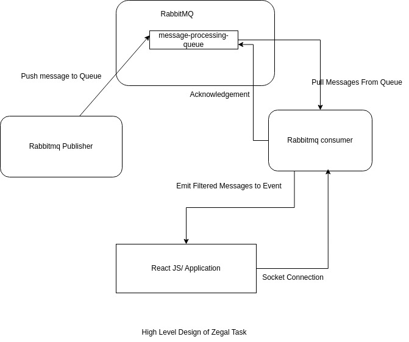

# High Volume Data Simulator and Processor
Welcome to the High Volume Simulator and Processing System! This document provides an overview of the architecture and components that interacts with each other. Also,you will find the quick guide to setup or running the application locally

## Requirements
* Node v14+
* Rabbitmq exposed at port 5672

## System Diagram

Below is a high-level system diagram illustrating the components and interactions of the Awesome System:



EXPLANATION:
Publisher publishes 20 unique messages per second to the queue and the consumer pulls messages from the queue,filters the message having priority >=7,and emit via socket.io to the react application (UI) which is connected to the consumer via a socket connection.


## Getting Started with Development
To setup locally, run

```sh
 // TO RUN BACKEND
cd backend 
- Copy `.env-SAMPLE` to `.env`
yarn install
yarn run start

// TO RUN FRONTEND- Open another terminal into the root folder
cd frontend
npm install
npm start
```

Visit, http://localhost:3000 in your browser
